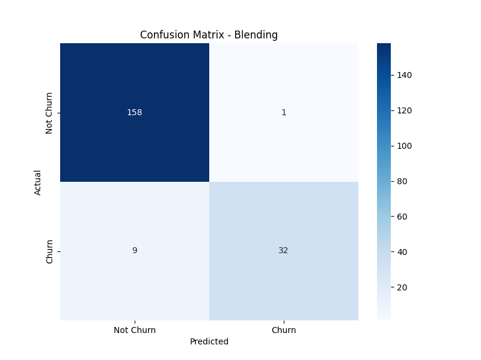
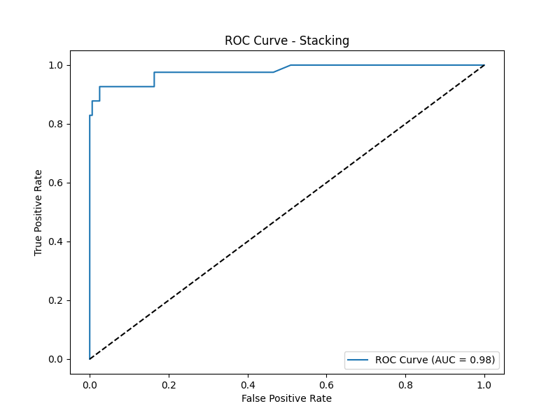

# Ensemble Classifiers for Churn Prediction: A PoC

This project provides a Proof-of-Concept (PoC) for building and productionizing ensemble classifiers, specifically focusing on **Blending** and **Stacking**. It demonstrates how to combine multiple machine learning models to improve predictive performance and robustness, a common practice in competitive machine learning and real-world MLOps pipelines.

The project uses a synthetic churn dataset to train, evaluate, and serve the ensemble models, with full experiment tracking using MLflow.

## Table of Contents

- [Ensemble Learning Concepts](#ensemble-learning-concepts)
  - [Blending](#blending)
  - [Stacking](#stacking)
- [Project Structure](#project-structure)
- [Installation Guide](#installation-guide)
- [Usage](#usage)
  - [1. Create the Dataset](#1-create-the-dataset)
  - [2. Train the Models](#2-train-the-models)
  - [3. Track Experiments with MLflow](#3-track-experiments-with-mlflow)
  - [4. Serve the Model with FastAPI](#4-serve-the-model-with-fastapi)
- [Results](#results)
  - [Blending Model Performance](#blending-model-performance)
  - [Stacking Model Performance](#stacking-model-performance)

---

## Ensemble Learning Concepts

Ensemble learning is a machine learning paradigm where multiple models (often called "base learners") are trained to solve the same problem and combined to get better results. The main idea is that a diverse set of models, when combined, can achieve higher accuracy and be more robust than any single model.

### Blending

Blending is an ensemble technique that uses a hold-out validation set to train a "meta-model" that learns to combine the predictions of the base learners.

**Conceptual Steps:**

1.  **Split Data**: The training data is split into a training set and a validation set.
2.  **Train Base Models**: The base models are trained on the training set.
3.  **Create Meta-Features**: The trained base models make predictions on the validation set. These predictions become the input features (meta-features) for the meta-model.
4.  **Train Meta-Model**: The meta-model is trained on these meta-features, using the true labels of the validation set as the target.

**Mathematical Deduction:**

Let the training data be $(X_{train}, y_{train})$ and the validation data be $(X_{val}, y_{val})$.

1.  Train $k$ base models $M_1, M_2, ..., M_k$ on $(X_{train}, y_{train})$.
2.  Generate predictions on the validation set: $P_i = M_i(X_{val})$ for $i=1, ..., k$.
3.  Create a new dataset for the meta-model: $X_{meta} = [P_1, P_2, ..., P_k]$.
4.  Train the meta-model $M_{meta}$ on $(X_{meta}, y_{val})$.

For a new data point $x_{new}$, the final prediction is $M_{meta}([M_1(x_{new}), M_2(x_{new}), ..., M_k(x_{new})])$

**Use Cases:**

-   **Kaggle Competitions**: Widely used to squeeze out the last bit of performance by combining models from different families (e.g., tree-based, linear, neural networks).
-   **Financial Modeling**: For credit scoring or fraud detection, where combining different models can lead to more reliable predictions.

### Stacking

Stacking (Stacked Generalization) is similar to blending but uses out-of-fold predictions from a cross-validation strategy to generate the meta-features. This allows the meta-model to be trained on predictions from the entire training dataset.

**Conceptual Steps:**

1.  **Split Data**: The training data is split into $k$ folds.
2.  **Train Base Models**: For each fold, the base models are trained on the other $k-1$ folds.
3.  **Create Meta-Features**: The trained models then make predictions on the held-out fold. This process is repeated for all folds, resulting in a set of meta-features for the entire training dataset.
4.  **Train Meta-Model**: The meta-model is trained on these out-of-fold predictions.
5.  **Final Base Models**: The base models are retrained on the entire training dataset.

**Mathematical Deduction:**

Let the training data be $(X_{train}, y_{train})$.

1.  Split $(X_{train}, y_{train})$ into $k$ folds.
2.  For each fold $j=1, ..., k$:
    -   Train base models $M_i$ on the other $k-1$ folds.
    -   Generate predictions $P_{ij}$ on fold $j$.
3.  The meta-features for the training set are $X_{meta} = [P_{i1}, P_{i2}, ..., P_{ik}]$ for each model $i$.
4.  Train the meta-model $M_{meta}$ on $(X_{meta}, y_{train})$.

For a new data point $x_{new}$, the final prediction is $M_{meta}([M_1(x_{new}), M_2(x_{new}), ..., M_k(x_{new})])$, where the base models $M_i$ have been retrained on the full training data.

**Use Cases:**

-   **Robust Production Models**: Stacking is excellent for building highly accurate and robust models for critical applications like medical diagnosis or demand forecasting.
-   **Customer Behavior Prediction**: In marketing, stacking can combine models that capture different aspects of customer behavior to provide a more accurate churn or conversion prediction.

---

## Project Structure

```
ensemble/
├── .git/                     # Git directory
├── images/                   # Directory for saved plots
├── mlruns/                   # MLflow experiment tracking data
├── models/                   # Saved trained models
├── utils/
│   └── io_utils.py           # Utility functions
├── churn_dataset.csv         # The generated dataset
├── create_dataset.py         # Script to generate the dataset
├── LICENSE                   # License file
├── main.py                   # Alternative training script (can be ignored)
├── README.md                 # This file
├── requirements.txt          # Python dependencies
├── serve_fastapi.py          # FastAPI application for serving the model
└── train.py                  # Main script for training and evaluation
```

---

## Installation Guide

1.  **Clone the repository:**

    ```bash
    git clone <your-repo-url>
    cd ensemble
    ```

2.  **Create a virtual environment (recommended):**

    ```bash
    python -m venv venv
    source venv/bin/activate  # On Windows, use `venv\Scripts\activate`
    ```

3.  **Install the dependencies:**

    ```bash
    pip install -r requirements.txt
    ```

---

## Usage

Follow these steps to run the project.

### 1. Create the Dataset

First, generate the synthetic churn dataset by running:

```bash
python create_dataset.py
```

This will create the `churn_dataset.csv` file in the root directory.

### 2. Train the Models

Next, run the training script. This will train both the Blending and Stacking classifiers, log the experiments to MLflow, and save the trained models and plots.

```bash
python train.py
```

You will see the output of the training process, including the metrics for each model.

### 3. Track Experiments with MLflow

This project is integrated with MLflow for experiment tracking. To view the results:

1.  **Run the MLflow UI:**

    ```bash
    mlflow ui
    ```

2.  **Open your browser** and navigate to `http://127.0.0.1:5000`.

You will find a run with a name like `ensemble_training_<timestamp>`, containing all the parameters, metrics, and artifacts (plots and models) for the training session.

### 4. Serve the Model with FastAPI

The best-performing model (the Stacking classifier) is saved and can be served via a REST API.

1.  **Start the FastAPI server:**

    ```bash
    uvicorn serve_fastapi:app --reload
    ```

2.  **Access the API documentation** at `http://127.0.0.1:8000/docs` to see the available endpoints.

3.  **Send a prediction request:**

    You can use `curl` or any API client to send a POST request to the `/predict` endpoint. The server will automatically load the latest trained model from the `models/` directory.

    ```bash
    curl -X POST "http://127.0.0.1:8000/predict" -H "Content-Type: application/json" -d '{
      "feature_0": 0.5, "feature_1": -1.2, "feature_2": 0.8, "feature_3": -0.4, "feature_4": 1.5, 
      "feature_5": -0.7, "feature_6": 0.3, "feature_7": -0.1, "feature_8": 1.1, "feature_9": -0.9,
      "gender": "Female",
      "subscription_plan": "Premium"
    }'
    ```

---

## Results

The training script evaluates both the Blending and Stacking models and saves the results as plots. Here are examples of the kind of output you can expect.

*(Note: These images are placeholders. The actual images will be generated in the `images/` directory when you run `train.py`)*

### Blending Model Performance

**Confusion Matrix**



**ROC Curve**


### Stacking Model Performance

**Confusion Matrix**


**ROC Curve**

